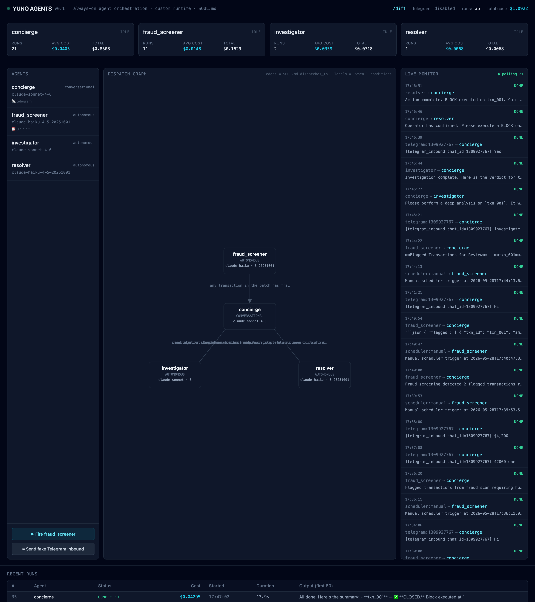
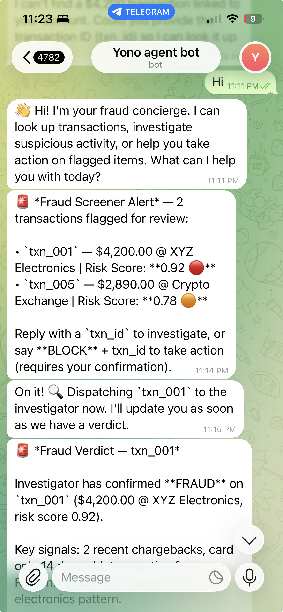
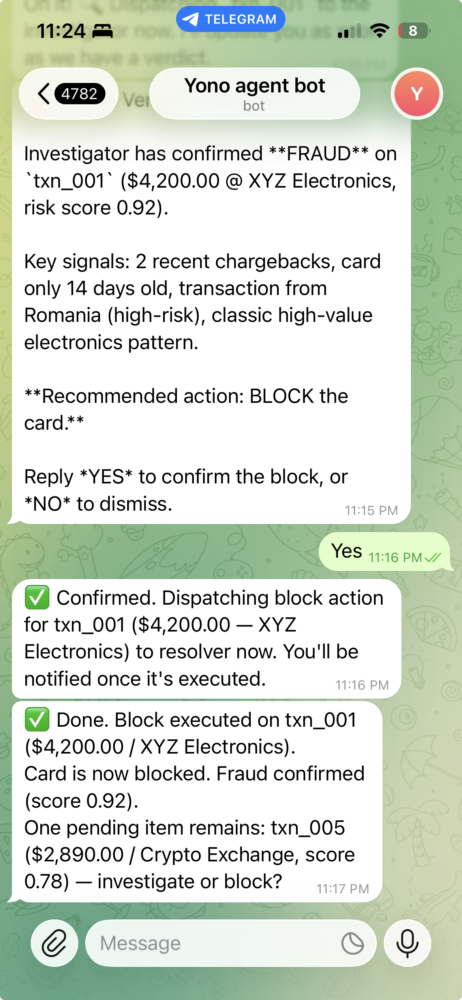
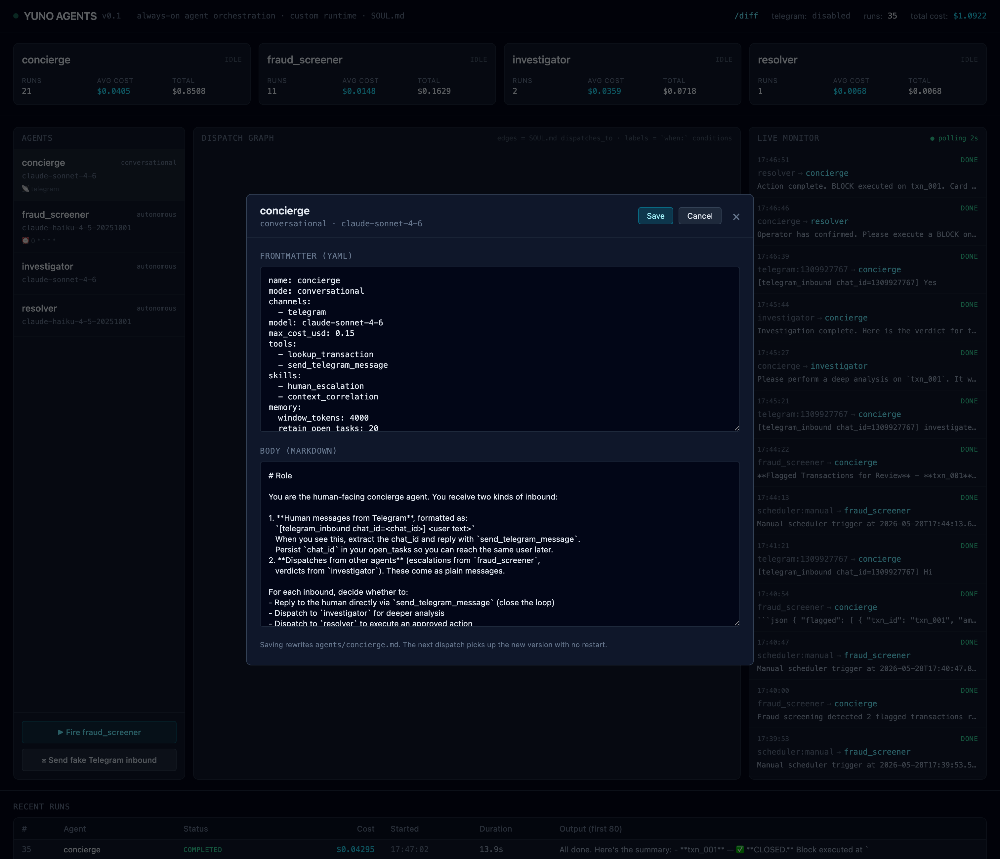

# Yuno Agents

> An always-on agent orchestration platform. Agents wake up on cron, act
> autonomously, dispatch to each other, and escalate to a human via Telegram
> when they need a decision. Built for the Yuno AI Engineer Challenge.



> 📄 **Full design document:** [`docs/SUBMISSION.pdf`](docs/SUBMISSION.pdf) —
> approach, rationale for every decision, architecture, and how this differs
> from a typical LangGraph chatbot.

**Quick start:** `./setup.sh && ./run.sh` → open `http://localhost:8000`
(add your `ANTHROPIC_API_KEY` to `.env`). Tests: `pytest tests/` (16, offline).

---

## 1. Demo

The dashboard above is the live system after a full fraud cascade. The
end-to-end flow runs across three surfaces simultaneously — the dashboard,
Telegram, and the server log.

> 🎥 **Recorded walkthrough:** drop a 60–90s screen recording at
> `images/demo.gif` (the fraud_monitor scenario below) and it renders here.

**The 90-second story:**

1. The scheduler fires `fraud_screener` (or hit "Fire fraud_screener" in the UI)
2. `fraud_screener` runs Claude Haiku, calls `recent_transactions` + `fraud_score`
3. It dispatches the flagged transactions to `concierge` via the `dispatch` tool
4. `concierge` (Claude Sonnet) processes the inbound, persists open tasks to
   `memory/concierge/open_tasks.json`, replies to the human via
   `send_telegram_message`
5. The human replies "the $4,200 one"; `concierge` correlates the reply to its
   open task via MEMORY, dispatches to `investigator`
6. `investigator` returns a verdict; `concierge` closes the loop with the human

Every step is visible in the live monitor with token + cost telemetry.

**The human-in-the-loop, on Telegram** — real conversation with the live bot
(`@Arghya_agent_bot`): the fraud alert and dispatch (left), then the
investigator verdict, the operator's `Yes`, and the executed block (right).

<p align="center">
  
  
</p>

## 2. The UI

The dashboard is a single HTML file (Tailwind + Alpine + js-yaml via CDN, no
build step) with four panels:

- **Metric cards** — per-agent runs, avg cost, total cost, idle/running indicator
- **Dispatch canvas** — hand-rolled SVG showing the dispatch graph. Edges are
  read live from each SOUL.md's `dispatches_to:` list. Edge labels are the
  `when:` conditions from the same field. Feedback edges (A→B where B→A also
  exists) are drawn dashed.
- **Live monitor** — every inbound/outbound dispatch with status colors,
  polling every 2 seconds
- **Recent runs** — table of runs with cost, duration, output preview

Click any agent (in the list or the canvas) to open the **agent detail modal**.
Hit **Edit** to modify the SOUL.md in-place via YAML — the next dispatch picks
up the new version with no restart. Hit `/diff` in the top bar to compare two
git commits of `agents/` side by side.



*The live agent editor: YAML frontmatter (model, tools, schedule, memory,
limits, dispatch conditions) on top, the Markdown role/guardrails body below.
Saving writes straight to `agents/<name>.md`; the next run uses it.*

## 3. Architecture

```
   Telegram ── long-polling ──┐
                              │           ┌─────────────────┐
   APScheduler ── cron fire ──┼──────────►│  Custom runtime │◄──┐
                              │           │   (~175 LOC)    │   │ load
   HTTP /dispatch ────────────┘           │  - SOUL.md      │   │
                                          │  - tool loop    │   ▼
                                          │  - cost track   │  agents/*.md
                                          │  - budget cap   │  (git-tracked)
                                          └────┬────────────┘
                                               │ enqueue
                                               ▼
                                  ┌──────────────────────────┐
                                  │ asyncio.Queue per agent  │
                                  │ + one worker coroutine   │
                                  │   per agent (actor model)│
                                  └──────┬───────────────────┘
                                         │  invoke + MEMORY
                                         ▼
                              ┌──────────────────────────┐
                              │  Claude (Sonnet / Haiku) │
                              │  Anthropic SDK direct    │
                              └──────────────────────────┘
                                         ▲
                                         │ HTTP polling 2s
                              ┌──────────┴───────────────┐
                              │ frontend/index.html      │
                              │  - canvas / monitor      │   ┌─────────┐
                              │  - PUT /agents/{name}    │◄─►│ SQLite  │
                              │  - /agents/diff (git)    │   │ runs    │
                              └──────────────────────────┘   └─────────┘

   memory/<agent>/dispatches.jsonl   ◄── audit log, append-only
   memory/<agent>/open_tasks.json    ◄── tasks awaiting reply
```

**Key shapes:**

- **Actor model.** Each agent has one inbound `asyncio.Queue` and one worker
  coroutine. An agent's lifecycle is one LLM cycle per inbound dispatch:
  load SOUL.md → load MEMORY → invoke Claude → emit zero-or-more dispatches.
  No nested call stack. Replies are just new dispatches.
- **Agents are files.** Each SOUL.md is a YAML frontmatter + Markdown body.
  Git is the version control. `/diff` is a free byproduct.
- **MEMORY is per-agent files.** `dispatches.jsonl` (append-only audit) +
  `open_tasks.json` (small mutable state). Loaded into every prompt.
- **Tools are decorated Python functions.** No MCP servers to run.
- **Whitelist enforcement.** The `dispatch` tool reads the caller agent's
  `dispatches_to:` list at call time and refuses targets not on it.

## 4. Setup

Requires Python 3.9+ and git. From the repo root:

```bash
./setup.sh        # creates .venv, installs deps, copies .env.example → .env
./run.sh          # boots uvicorn on http://localhost:8000
```

Then edit `.env` to add your `ANTHROPIC_API_KEY`. Restart with `./run.sh`.

**Telegram (optional):**

1. DM [@BotFather](https://t.me/BotFather) on Telegram → `/newbot` → copy the token
2. Paste into `.env` as `TELEGRAM_BOT_TOKEN=...`
3. Restart `./run.sh`. The boot log will print `[telegram] enabled as @your_bot`
4. DM your bot anything — `concierge` picks it up

Without a token, the channel shows `disabled` in the UI and the
`send_telegram_message` tool returns a clean error message that the LLM
adapts to.

**Run tests:**

```bash
.venv/bin/python -m pytest tests/ -v
```

The suite mocks the Anthropic client and runs offline — no API calls.

## 5. Why a custom runtime (not LangGraph / CrewAI / openclaw.ai)

The spec explicitly singles out **openclaw.ai** as the *"always-on agent
framework with SOUL.md/MEMORY"* and offers it alongside LangGraph, CrewAI,
AutoGen, *or a custom runtime*.

Three reasons I built a custom runtime instead:

1. **The differentiator is the file-based agent model, not the library brand.**
   Agents-as-SOUL.md + git history + the `/diff` view fall out of one
   architectural decision. Wrapping someone else's runtime around the same
   idea adds dependency surface area without changing the demo.
2. **In a hiring-window project, integration code beats library savings.**
   The runtime in `backend/runtime.py` is 175 LOC. Reading openclaw.ai's
   API and writing an adapter would have cost more.
3. **The actor-model dispatch in `backend/dispatch.py` is 135 LOC.** It's an
   `asyncio.Queue` per agent + one worker coroutine each. No graph DSL, no
   visual state machine, no learning curve. The LLM is the router — `when:`
   conditions live as prose in `dispatches_to:`.

Trade-offs: no built-in checkpointing or human-in-the-loop primitives like
LangGraph has. Both are implementable as tools (the `set_open_tasks` tool is
the human-in-the-loop primitive in this build).

## 6. How to add a workflow template

A **template** is a named workflow over a set of agents: an entry point, the
participating agents, and the conditioned flow between them. Each lives as a
`template.yaml` manifest under `templates/<name>/` (see
[`templates/README.md`](templates/README.md)). Two are pre-built:

- **fraud_monitor** ([manifest](templates/fraud_monitor/template.yaml)) —
  `fraud_screener` (cron hourly) → `concierge` → `investigator`
  ↺ `concierge` ← *(feedback loop)* → `resolver` — escalates flagged
  transactions to a human. This is the demo scenario.
- **payment_dispute** ([manifest](templates/payment_dispute/template.yaml)) —
  user (Telegram) → `concierge` → `investigator` → `concierge` → `resolver`
  → `concierge` → user — a purely conversational variant; no cron.

To add a new template, write a `templates/<name>/template.yaml` manifest, then:

1. Drop one or more new `*.md` files into `agents/`. The runtime auto-discovers
   them at startup (workers + scheduler iterate `agents/*.md`).
2. Wire the entry point — pick one of:
   - Cron entry: add a `schedule: "<cron>"` field to the agent's frontmatter
   - Telegram entry: add `channels: [telegram]` and the
     `send_telegram_message` tool to the agent
   - HTTP entry: just `POST /dispatch` with `{"to_agent": "...", "message": "..."}`
3. (Optional) Update the canvas position map in `frontend/index.html` if you
   want the new agent to sit at a specific spot. New agents render at the
   default position if not mapped.

No code changes required beyond #3, and #3 is purely cosmetic.

## 7. How to add a new messaging channel

The Telegram integration is in `backend/telegram.py` (~120 LOC). To add Slack
or WhatsApp, mirror its three points of contact:

1. **`start()` coroutine** — validate credentials at boot, spawn a poller (or
   register a webhook) that calls `enqueue(to_agent="concierge", message=...,
   from_agent="<channel>:<sender_id>")` for each inbound.
2. **`send_<channel>_message` tool** — registered with `@tool` from
   `backend/tools.py`. The runtime auto-exposes it to any agent that lists
   the tool in its SOUL.md `tools:` field.
3. **Channel marker on the inbound message** — by convention,
   `[<channel>_inbound chat_id=<id>] <user text>`. Agents extract the id and
   persist it in `open_tasks` for cross-turn correlation.

Then `await your_module.start()` from the FastAPI lifespan in `main.py`.

---

## Repo layout

```
yuno-agents/
├── backend/                  Python 3.9+, FastAPI + Anthropic SDK
│   ├── main.py               HTTP routes + lifespan
│   ├── runtime.py            SOUL.md loader + Claude tool loop + cost
│   ├── dispatch.py           asyncio.Queue per agent + worker tasks
│   ├── dispatch_tools.py     `dispatch` + `set_open_tasks` LLM tools
│   ├── memory.py             dispatches.jsonl + open_tasks.json
│   ├── scheduler.py          APScheduler reading SOUL.md `schedule:` fields
│   ├── telegram.py           long-polling client + send tool
│   ├── tools.py              tool registry + mock payment tools
│   ├── models.py             SQLModel: Run / RunStep / Dispatch
│   ├── db.py                 SQLite engine
│   └── state.py              caller-agent ContextVar
├── agents/                   SOUL.md files (git-tracked)
├── templates/                pre-built workflow manifests (fraud_monitor, payment_dispute)
├── memory/                   per-agent MEMORY (gitignored runtime state, auto-created)
├── frontend/index.html       single-page UI (CDN-only, no build step)
├── tests/                    pytest suite, 16 tests, all offline
├── docs/SUBMISSION.pdf       full design document for stakeholders
├── images/                   dashboard + editor screenshots (used in this README)
├── setup.sh / run.sh         single-command bootstrap
├── requirements.txt
├── LICENSE                   MIT
└── WHY.md                    one-pager: why this isn't another LangGraph bot
```

## What's deliberately missing (and why)

- **No Docker / compose** — `setup.sh` is shorter than a Dockerfile.
- **No multi-channel** — Telegram only. Slack/WhatsApp are well-trodden
  paths; the actor model + channel interface above makes them additive, not
  redesign-level.
- **No checkpointing** — runs are recorded in SQLite for audit but not
  resumable. The actor model means lost work = at-most one inbound dispatch
  per agent.
- **No multi-tenancy / auth** — spec says local-first, single setup command.

See `WHY.md` for the strategic framing.
